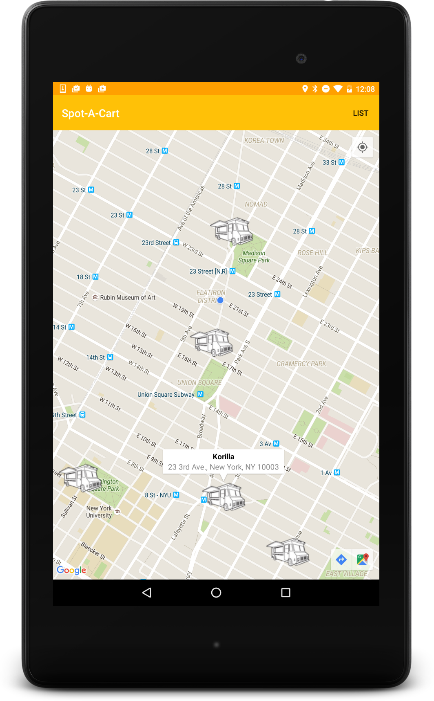
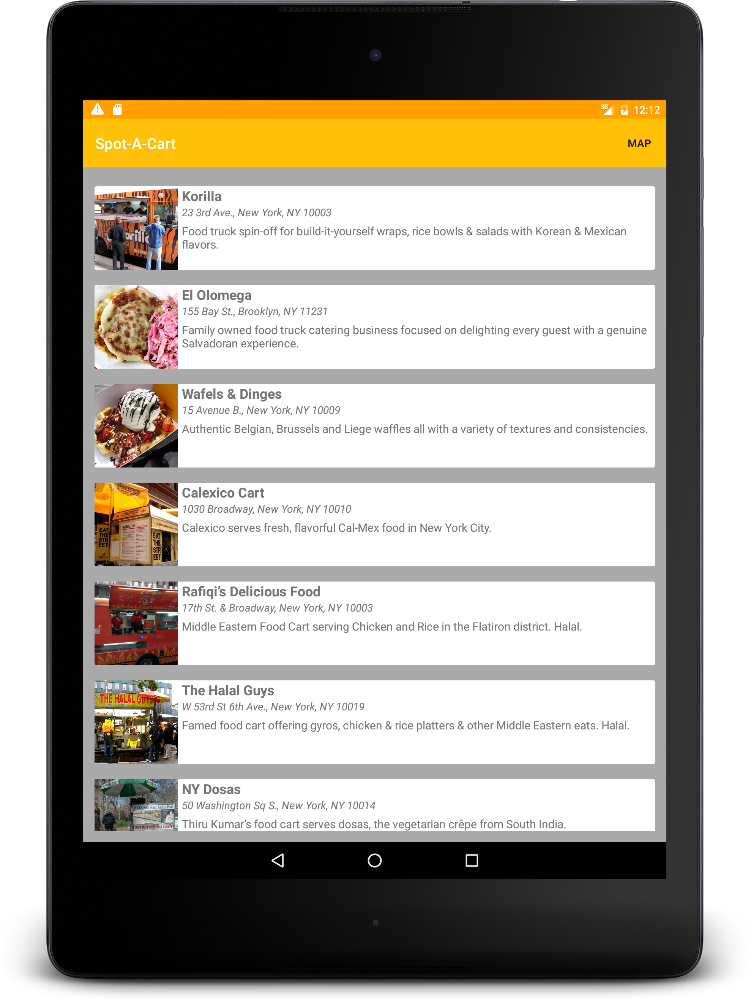
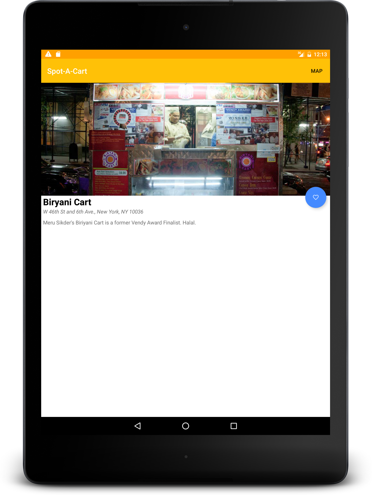

#  Project Readme :fire:

title | type | creator
----- | ---- | -------
Spot-A-Cart | Project 4 | Adityo Sagir (ADI - New York)

## Overview

Spot-A-Cart is a Food Cart app that allows users to look at Food Carts based on their location. It integrates the Google API to get your current location and populate Food Carts (name, address, and description).

Users can favorite Food Carts they like the most.

## Screenshots

A portrait screenshot of your current location and closest Food Carts to your location 

A portrait screenshot of the list of Food Carts 

A portrait screenshot of details of the Food Carts and ability to Favorite 

## Enjoy Spot-A-Cart :)
